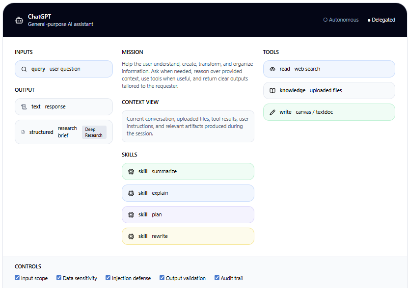
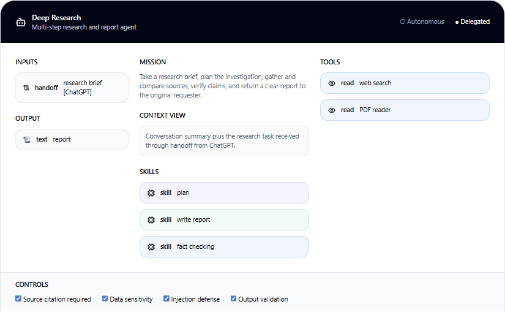
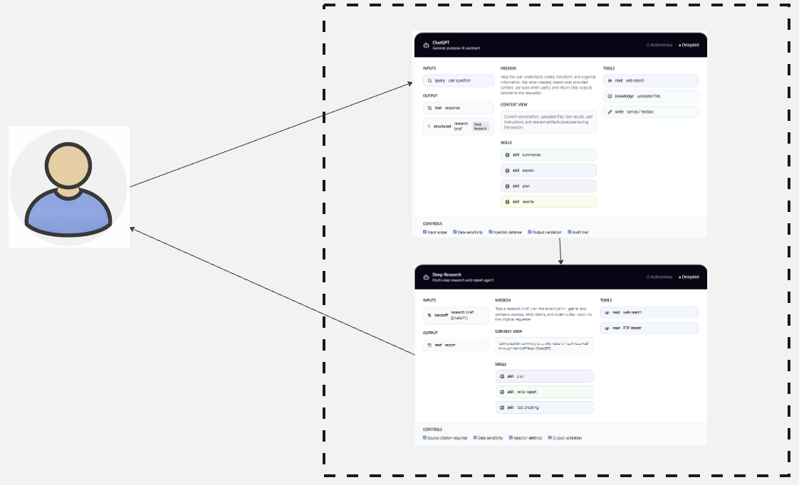

# Agent Blueprint

The Agent Blueprint is a visual design canvas for defining AI agents before implementation.

It is meant for high-level, workshop-friendly design work: a shared artifact that business stakeholders, architects, and engineers can use to align on what an agent is, what it can do, what it must not do, and how multiple agents share context.

The canonical specification lives in [manifest.md](manifest.md).

## Why This Exists

Agent design conversations break down because too many concerns must be held in working memory at once: inputs, outputs, tools, skills, controls, and shared context boundaries.

The Agent Blueprint externalizes that discussion into a structured visual form.

It is not a deployment spec and it is not a prompt template.
It is the design artifact that sits before detailed technical design.

## What It Does Not Cover

The Agent Blueprint Canvas is a pre-implementation design artifact.
It is not a substitute for downstream engineering artifacts.

It does not define:

1. Detailed technical design, component interactions, or runtime architecture.
2. Interface and protocol contracts such as MCP, A2A, REST, events, or transport bindings.
3. Memory implementation details such as storage, retrieval, retention, synchronization, or lifecycle rules.
4. Knowledge ingestion pipelines, database synchronization, indexing, refresh jobs, or ETL-style content preparation.
5. Evaluation design such as metrics, benchmarks, test harnesses, or acceptance thresholds.
6. Observability design such as logs, traces, metrics, alerts, or audit pipeline implementation.
7. Runtime hooks, middleware wiring, extension points, or execution lifecycle callbacks.
8. Workflow orchestration notation such as BPMN, gateways, loops, retries, approvals, or escalation semantics.

Those concerns belong to technical design, workflow design, and implementation artifacts that follow the canvas.

## Canvas Structure

The v1 Agent Blueprint Canvas contains eight sections:

1. Header
2. Inputs
3. Mission
4. Context View
5. Skills
6. Tools
7. Output
8. Controls

Shared context itself is not part of the canvas.
Shared context is represented by a Context Boundary in the surrounding system view.

## Visual Examples

Single-agent example:

Specialist-agent example:

Shared-context system example:

## Repository Contents

- [manifest.md](manifest.md): canonical v1 specification
- [templates/agent-blueprint-canvas.md](templates/agent-blueprint-canvas.md): text-first fill-in template
- [templates/agent-blueprint-library.excalidrawlib](templates/agent-blueprint-library.excalidrawlib): reusable Excalidraw component library
- [examples/chatgpt-deep-research.md](examples/chatgpt-deep-research.md): worked multi-agent example

## How To Use It

1. Define the Agent Blueprint Canvas using the section structure in [manifest.md](manifest.md).
2. Place one or more canvases inside a larger system view.
3. Use a dashed Context Boundary to show which agents share the same session context.
4. Use Context View on each canvas to show which part of that shared context the agent actually reads.
5. Use BPMN or similar workflow notation if you need explicit sequencing, branching, retries, approvals, or escalation logic.
6. Treat the result as the handoff artifact for detailed technical design and workflow design.

## License

Created by Marijus Masteika.
Licensed under CC BY 4.0. See [LICENSE](LICENSE).